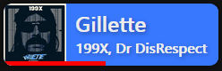
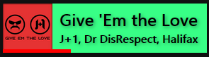

# Current Song

This application allows users (probably streamers) to show the playing song
without worrying too much about the setup. Ideally you'll install the extension, start
a service, and you are good to go. Now with Spotify you can't do this, you'll have to manually go in your browser and get the cookie.
Maybe I'll change that.

# Sections

- [Main Features](#main-features)
- [Supported Interfaces](#supported-interfaces)
- [How to set it up](#how-to-set-it-up)
- [Examples](#examples)
- [Developing](#developing)

### Main Features

- It's one of the first _true_ **realtime** clients for Spotify and YouTube (VLC does not provide a realtime API).
  The local server **does not** constantly poll Spotify and YouTube.
- Watch progress is shown for Spotify _and_ YouTube (others to come).
- The server can be ran as a **Windows Service** so won't show up as a window and is started once the PC starts.
- It always tries to show the last updated source so viewers immediately know the song.
- The overlay is _fully customizable_ through the `config.css` file in the `overlay` directory.

# Supported Interfaces

- Firefox, Chrome, new Safari (and other Browsers implementing the [WebExtensions API](https://developer.mozilla.org/en-US/docs/Mozilla/Add-ons/WebExtensions/API/tabs))
- Spotify (requires a Cookie to work, any device is supported)
- VLC (RC-Interface)

## Supported Websites

These are **known** websites, the browser extension works with.
Websites not listed here aren't tested yet but **might** already be supported.

| Website       | Title              | Progress Bar          |
| ------------- | ------------------ | --------------------- |
| YouTube       | :white_check_mark: | :white_check_mark: \* |
| Plug.Dj       | :white_check_mark: | :white_check_mark:    |
| SoundCloud    | :white_check_mark: | :white_check_mark:    |
| Twitch        | :white_check_mark: | :x:                   |
| CyTube        | :x:                | :x:                   |
| Neverthink.tv | :x:                | :x:                   |

\* Livestreams aren't supported

# How to set it up

Extract the `build-...zip` into some folder.

This application consists of multiple "modules" you can toggle.
You can enable and disable modules in the `.env` file (open it with any text editor).

Once you configured the `.env` file, you can start the application, or create a service which runs all the time, so you don't have to care about it.
_Pro tip_: Create a backup of your `.env` file, so you don't replace it by accident.
To set up the service,

1. Run `create-service.bat` **as Administrator** (right click the file and select `Run as Administrator`).
   _Note:_ your AntiVirus might question this action or block it.
2. Start the service by running `start-service.bat` **as Administrator**.

You can restart the service (needed once you've changed `.env`).

You are also able to change the appearance of the overlay. To do this, open the `config.css` in the `overlay` directory.
You don't have to restart the service. You only need to **reload** the overlay.

**This is how you configure each module:**

## Spotify

1. Get the `sp_dc` cookie from `open.spotify.com` (see below for Chrome and Firefox)
2. Open the `.env` file in the current folder
3. Paste **the value** next to `SPOTIFY_COOKIES="sp_dc=`
4. The line should now look like this: `SPOTIFY_COOKIES="sp_dc=AB3DE6...-A2CD5FG..."`
5. Set `ENABLE_SPOTIFY=true` (previously `...=false`)

### Chrome

1.  Open `open.spotify.com` (and log in)
2.  Open the Developer Tools (`CTRL + SHIFT + I` or `F12`)
3.  Go to the `Application Tab`
4.  In the left pane, in `Storage`, select `Cookies` and then `https://open.spotify.com`
5.  In the table, search in the `Name` column for `sp_dc`
6.  Copy the `Value` (**double-click** the cell and press `CTRL + C`)

### Firefox

1.  Open `open.spotify.com` (and log in)
2.  Open the Developer Tools (`CTRL + SHIFT + I` or `F12` or `SHIFT + F9`)
3.  Go to the `Storage` Tab
4.  In the left pane, select `Cookies` and then `https://open.spotify.com`
5.  In the table, search in the `Name` column for `sp_dc`
6.  Copy the `Value` (**double-click** the cell and press `CTRL + C`)

## Browser

### Firefox

Search on addons.mozilla.org for '**Current Song Overlay**'.

### Chrome

Currently, I can't publish the extension to the Chrome WebStore.
So you'll need to install an unpacked extension in 'Developer Mode'.

1. Go to `chrome://extensions`
2. Enable **Developer Mode** in the top right corner
3. Click on '**Load Unpacked**'
4. Navigate to the extension folder and click Open

Now the extension is loaded. **Keep in mind**: Each time you open Chrome, you'll get a popup, saying you've loaded an unpacked extension. You can ignore this warning.

## VLC

1. Press `CTRL + P` (opens the settings)
2. select `All` in the bottom left corner to show all settings
3. Go to `Interface` > `Main Interface` > `RC`
4. Set the TCP Command Input to `localhost:234`
5. Restart VLC

# Examples

### YouTube Player

### Spotify Player

### Styled Player

# Developing

- **Client (Overlay)**
  ~~Run `npm i` or `yarn` and run the script `dev`. It will automagically rebuild.
  You can (most of the time) access the overlay on `localhost:5000`.~~
  You can use the server's functionality of hosting the overlay.
  Define the `NON_BUILD_ENV` environment variable (the value doesn't matter, use e.g. 1) and run the server.

- **Extension**
  Run `npm i` or `yarn` and run the script `rollup-watch`.
  You can import the extension in Firefox in `about:debugging#/runtime/this-firefox`.

- **Server**
  Run `deno run --allow-read --allow-net --allow-env server/src/index.ts`.
  It will read the `.env` file, however it _won't_ automatically rebuild.
